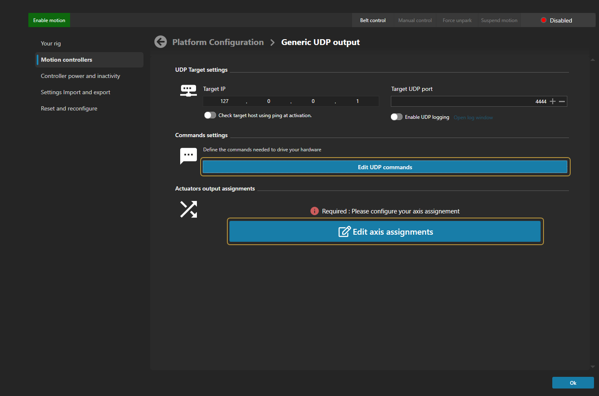
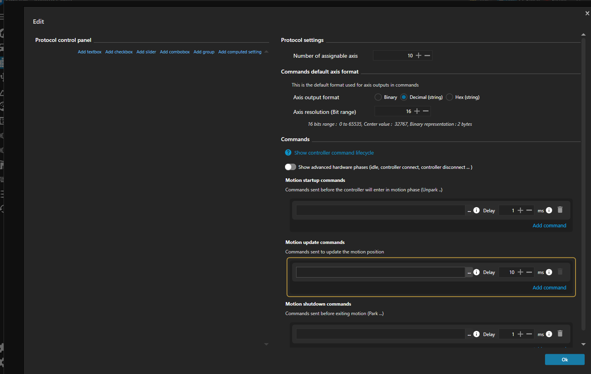
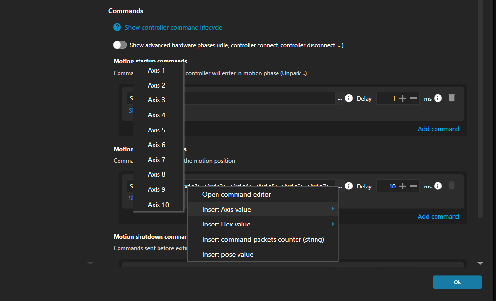
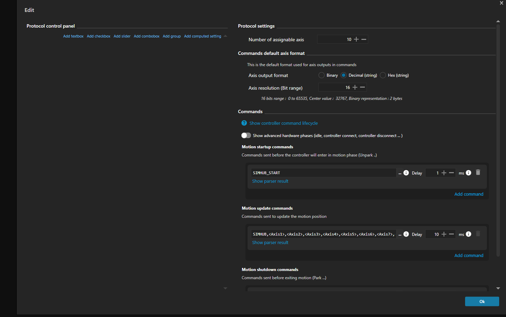

# First setup: Raspberry Pi, start to finish

This walks you from a blank SD card to a moving rig with the Pi as the
motion controller. One script does the operating system work; the rest is
clicking through the web UI. No Linux experience beyond copy-pasting
commands is assumed. Budget roughly 30 to 40 minutes for the install (most
of it compiling) plus however long your drive wiring takes.

Read [SAFETY.md](../SAFETY.md) before you power anything. The short
version: these are industrial servo drives moving real mass. Wire the
hardware e-stop first, keep a hand near it for every first, and never put
a person on the rig until it has done the same motion empty.

---

## What you need

**Controller**
- Raspberry Pi 4 or 4B, any RAM size (1 GB works; 2 GB+ builds faster).
- A 16 GB or larger microSD card, A1/A2 class preferred.
- Power supply for the Pi (the official 5V/3A USB-C supply or similar).
- Last validated on Raspberry Pi OS Lite 64-bit (trixie) with the 6.18
  PREEMPT_RT kernel. Newer point releases normally just work; if you hit
  trouble on a much newer base, mention your `uname -r` when reporting it.
- A **USB Ethernet adapter** for the Pi plus one Ethernet cable: the
  dedicated telemetry link to the game PC (step 6). USB 3 gigabit
  adapters are cheap and well supported.
- The Pi's **onboard Ethernet port is reserved for the EtherCAT chain**.
  It talks to the drives, nothing else. Wi-Fi is the admin path: SSH and
  browsing the web UI from your other devices.

**Rig**
- StepperOnline A6-EC servo drives (one per axis), motors, and the
  mechanics they move.
- Ethernet cables daisy-chained: Pi onboard port → drive 1 IN,
  drive 1 OUT → drive 2 IN, and so on. Order along the chain determines
  drive numbering.
- A hardware e-stop wired to the drives. This is the safety device; the
  software cannot replace it.

**Game PC**
- SimHub (or other motion software that can send a custom UDP string).
- An Ethernet port for the telemetry cable to the Pi. A dedicated port
  is ideal (Intel-chip PCIe cards are the safe pick if adding one);
  step 6 also covers sharing your PC's only port without losing its
  normal use.
- SSH available (Windows 10 and later have `ssh` built into PowerShell;
  nothing to install).

---

## Step 1: Flash the card

1. Install [Raspberry Pi Imager](https://www.raspberrypi.com/software/)
   on your PC.
2. Choose OS: **Raspberry Pi OS Lite (64-bit)** (under "Raspberry Pi OS
   (other)"). Lite, not Desktop; this is a headless controller.
3. Before writing, open the customization settings (the gear icon, or
   Imager asks automatically) and set:
   - a **hostname** (suggestion: `nullcat`, which puts the web UI at
     `http://nullcat.local:8080`),
   - your **username and password**,
   - your **Wi-Fi** network and country,
   - **enable SSH**.
4. Write the card, put it in the Pi, power up, give it a minute.

## Step 2: Run the installer

From PowerShell (or any terminal) on your PC, using the hostname and
username you set in Imager:

```
ssh <your-user>@<your-hostname>.local
```

Accept the host key prompt (type `yes`), log in with your password, then:

```
git clone https://github.com/crossthenoughts/nullCAT.git
cd nullCAT
./pi/os-setup/install.sh
sudo reboot
```

The script prints what it is doing at every step and is safe to re-run
if anything interrupts it. It installs the real-time kernel and selects
it for boot, applies the boot tuning (two CPU cores are reserved for the
control loop), builds the software, seeds the Pi's default configuration,
and installs everything as a service that starts on boot.

## Step 3: Verify

SSH back in after the reboot and run:

```
uname -r                      # must end in -rt
cat /proc/cmdline             # must contain isolcpus=2,3 ... threadirqs
systemctl status nullcat-pi   # active (running); press q to exit
```

Then from a browser on the same network, open
`http://<your-hostname>.local:8080`. The nullCAT dashboard should load, showing EtherCAT off and no drives.
That is a healthy controller with no bus connected.

The installer seeded `pi/build/host.json` with the two settings a headless
Pi needs (EtherCAT on the onboard port, web UI reachable from the LAN).
Everything else is edited from the web UI itself; the full key reference
is [CONFIG_REFERENCE.md](CONFIG_REFERENCE.md).

## Step 4: Prepare the drives (once per drive)

Fresh A6-EC drives need a few parameters set before first use: carrier
frequency, sync settings, and (recommended) the tuning baseline. Follow
[DRIVE_TUNING.md](DRIVE_TUNING.md): Step 1 there is done on each drive's
front panel in a couple of minutes; the advanced parameter cloning is
optional at this stage.

Then wire the chain and power the drives: Pi **onboard Ethernet port** →
drive 1 **IN**, drive 1 **OUT** → drive 2 **IN**, down the line. Every
drive panel should be lit.

## Step 5: Describe your axes (the web UI)

1. Open `http://<your-hostname>.local:8080` and expand the
   **Configuration** section.
2. Under **Axes**, describe each axis in chain order: a name, its type
   (vertical / horizontal / belt), stroke in mm, ballscrew pitch, encoder
   counts, and speed limits. Unsure? Start conservative; speeds can go
   up later.
3. **Save.** The controller picks the change up automatically; no
   restart needed. (If EtherCAT is already running, it applies at the
   next Initialize.)

The reference values for common setups are in
[CONFIG_REFERENCE.md](CONFIG_REFERENCE.md).

## Step 6: Connect the game PC (networking)

The game PC sends telemetry to the Pi as UDP packets, and that stream
**must run over a wire**: a USB Ethernet adapter on the Pi, one cable
straight to a spare Ethernet port on the game PC. Wi-Fi is not a
telemetry transport: congestion and latency spikes there turn into
visible stutters in the motion. The Pi's Wi-Fi stays useful for what it
is good at: SSH and opening the web UI from your PC, phone, or tablet.

The installer already configured the Pi's side of the link: the USB
adapter (`eth1`) has the fixed address **192.168.50.1**.

On the PC side there are two ways to provide the port, depending on
your hardware. Either way, prefer NICs with an **Intel chip**; they are
the best behaved for steady low-latency traffic.

**A dedicated port for the link** (a second onboard port, or an added
Intel PCIe card). Give it the link address as its only configuration:

1. Windows Settings → **Network & internet** → **Ethernet** → the
   adapter the cable is plugged into → **IP assignment: Edit**.
2. Choose **Manual**, enable **IPv4**, and set:
   - IP address: `192.168.50.2`
   - Subnet mask: `255.255.255.0` (prefix length 24)
   - Gateway and DNS: leave **empty** (this link carries telemetry only;
     leaving the gateway empty keeps your internet on its normal path).
3. Save. The link shows "No internet". That is correct and harmless.

**Sharing your PC's only Ethernet port.** The Settings page above
*replaces* the adapter's configuration, which would stop the port
working as a normal network port. Instead, add the link address as an
*additional* address: the port keeps its normal automatic (DHCP) setup
for when it is plugged into your router, and also answers on
`192.168.50.2` whenever the cable goes to the Pi. In PowerShell,
**run as administrator**:

```
netsh interface ipv4 add address "Ethernet" 192.168.50.2 255.255.255.0
```

Replace `"Ethernet"` with your adapter's name if it differs (run
`ipconfig` and use the name after "Ethernet adapter"). The extra
address survives reboots; to remove it later:

```
netsh interface ipv4 delete address "Ethernet" 192.168.50.2
```

SimHub's target is `192.168.50.1` in both layouts. The web UI is also
reachable from the game PC at `http://192.168.50.1:8080` over the same
cable (handy if your Wi-Fi is down).

## Step 7: Connect SimHub

nullCAT listens for motion telemetry as plain UDP packets on port `4444`.
Any motion software that can send a custom UDP string can drive it. The
walkthrough below uses **SimHub**, which is what nullCAT's initial
testing was done with.

In SimHub on the game PC:

1. Go to **Motion controllers** and add a **Generic UDP output**.
2. Set **Target IP** to `192.168.50.1`, the Pi's end of the telemetry
   cable from step 6. (Do not leave the pre-filled `127.0.0.1`; that is
   "this PC", and your controller is the Pi.) Set **Target UDP port** to
   `4444`.

   

3. Click **Edit UDP commands**. Under **Protocol settings**:
   - **Axis output format:** *Decimal (string)*
   - **Axis resolution (Bit range):** *16*
   - **Number of assignable axis:** leave at *10*.

   

4. In the **Motion update commands** field, build the packet:
   - Type `NULLCAT` followed by a comma.
   - Click the **…** button beside the field, choose **Insert Axis value →
     Axis 1**.

     

   - Type another comma, insert **Axis 2**, and keep going through
     **Axis 10**. The field ends up reading
     `NULLCAT,<Axis1>,<Axis2>,…,<Axis10>`.

     

     *(The screenshot shows an older `SIMHUB` prefix; type `NULLCAT`.
     The startup/shutdown command boxes stay empty; nullCAT gates motion
     on its own readiness.)*
5. The **Delay** next to that command is how often SimHub sends. The
   default `10` ms is fine and light on CPU; `2` ms is SimHub's practical
   maximum (roughly 400 updates/second). Whether the difference is
   perceptible depends on the sim's own telemetry rate: Le Mans Ultimate
   updates at 60 Hz, so 10 ms loses nothing; Assetto Corsa updates at
   333 Hz, where 2 ms preserves the extra detail.
6. OK out of the commands dialog, then open **Edit axis assignments**
   (SimHub marks it *Required*) and map your motion effects onto the axis
   slots. **Axis 1 feeds your first configured nullCAT axis** (chain
   order), Axis 2 the second, and so on.

You can verify the link without a game: the **TELEMETRY** readout on the
dashboard shows *idle* with no data and flips to receiving (with a live
UDP rate) once SimHub's motion output is enabled.

## Step 8: First contact (Initialize)

Clear everyone away from the rig. Hand near the e-stop.

1. On the dashboard, click **INITIALIZE ETHERCAT**.
2. Within a few seconds the SLAVES readout should show all your drives
   found and the ETHERCAT readout goes to **OP** (operational). Each
   drive card lights up.

If it fails, check the usual four: drives powered, chain plugged into the
Pi's **onboard** port, first drive's IN port (not OUT), cables seated
mid-chain. The activity log at the bottom of the dashboard narrates every
attempt with reasons.

## Step 9: First motion (Start)

**The rig will move on this click.** Starting the loop automatically homes
every axis (a gentle push to its end stop to find zero), then moves to
center and holds. Watch the first one from a safe distance.

1. Click **START LOOP**.
2. The drive cards walk through homing → unparking → running. When
   everything settles, the rig is live and holding center.
3. Try the **E-STOP** button once now, on purpose, while nothing is
   riding the rig. Click **Park All** first and let the axes settle:
   an e-stop de-energizes the drives, and a vertical axis holding
   center will fall the rest of its stroke when that happens (a long
   drop on a tall rig). Parking sets the verticals down on their rest
   position so there is nothing left to fall. With the rig parked,
   press **E-STOP** and learn the release flow. You want the first
   press to not be an emergency.

**STOP LOOP** parks the axes (gently to their rest position) and stops.
With the loop stopped, the Initialize button relabels itself **Stop
EtherCAT**: that sets the verticals down on their stops and powers the
drives back to idle. Use it when you're done for the day.

Once the loop is running and SimHub is receiving game data, game motion
drives the rig.

## Optional extras

- **Belts (torque axes).** If your rig has belt tensioners, Slack /
  Tension belt controls appear automatically. Slack to get in and out of
  the seat; Tension to pull snug before driving.
- **USB button box.** Plug it into the Pi and bind physical buttons to
  actions (park, belt toggle, e-stop) on the web UI's bindings page. Press the button
  when prompted and it's captured.
- **GPIO control panel.** The Pi can drive a hardwired panel (buttons and
  LEDs on the GPIO header). Off by default; enable and pin-map it in the
  Configuration section if you build one.
- **Shutdown from the browser.** The dashboard's Shutdown button powers
  the Pi down cleanly. No SSH needed at the end of a session.

## Everyday flow after setup

Power drives and Pi → open the dashboard → **INITIALIZE** → **START
LOOP** → drive. When done: **STOP LOOP** → **Stop EtherCAT** → Shutdown.
Belts slack/tension around getting in and out. The controller service
starts with the Pi, so there is nothing to launch.

---

## If something goes wrong

| Symptom | First things to check |
|---|---|
| `<hostname>.local` does not resolve | Give it a minute after boot; try the Pi's IP from your router's client list; some Android devices cannot resolve `.local` names. |
| SSH warns "REMOTE HOST IDENTIFICATION HAS CHANGED" | Expected after reflashing the card (new install, new keys). `ssh-keygen -R <your-hostname>.local` on the PC, then connect again. |
| `uname -r` has no `-rt` after reboot | Re-run the installer (it logs the RT kernel install and boot selection), then reboot again. |
| Web UI does not load | `systemctl status nullcat-pi` over SSH; the service log is in `pi/build/logs/app.log` in your clone. |
| "No EtherCAT slaves found" at Initialize | Drives powered? Chain plugged into the **onboard** port? First drive's IN port (not OUT)? |
| A drive panel shows an `Er` code | Look it up in [DriveFacts.md](DriveFacts.md); many clear with **RESET FAULT**. |
| TELEMETRY stays idle with SimHub running | SimHub motion output enabled? Target IP `192.168.50.1`, port `4444`? Telemetry cable plugged into the **USB adapter** on the Pi (not the onboard port) and the PC end set to `192.168.50.2` (step 6)? Command format exactly as in step 7 (Decimal, 16-bit, `NULLCAT,` prefix)? |
| Motion feels wrong / too aggressive | Revisit axis speeds and stroke in the Configuration section; start lower. |
| Build ran out of memory | Re-run the installer; it resumes where it left off and builds with one job per GB of RAM automatically. |
| Anything unexplained | The dashboard's activity log narrates everything; the full log with timestamps is `pi/build/logs/app.log`. Read the last screenful, or attach it when asking for help. |

## Updating

Pre-1.0: `cd nullCAT && git pull && ./pi/os-setup/install.sh` (the
rebuild is the slow part), then `sudo reboot` or
`sudo systemctl restart nullcat-pi` if no OS-level files changed.
Versioned releases and a proper update command are planned for v1.0.
