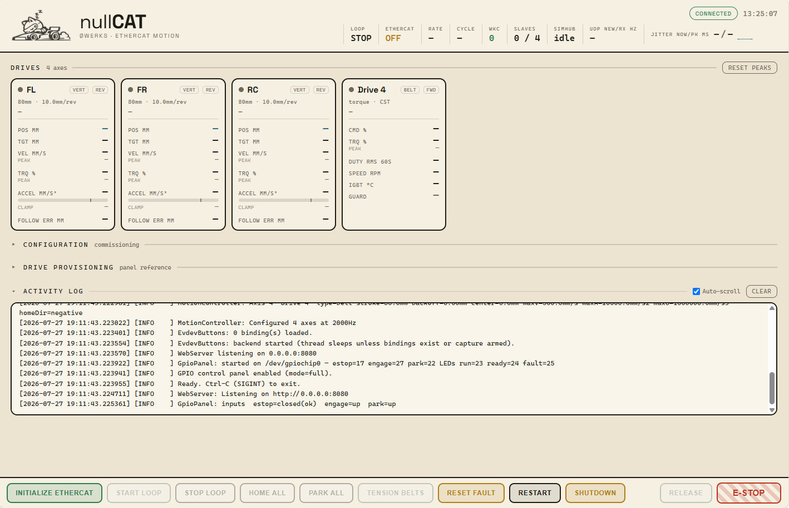

# nullCAT

An open-source EtherCAT motion controller for simracing motion rigs, built
around STEPPERONLINE A6-EC servo drives. One shared motion core, two
platforms:

- **Raspberry Pi (recommended):** headless daemon on Debian with the
  PREEMPT_RT kernel. Deterministic 2-4 kHz control loop, browser-based UI,
  physical GPIO control panel support (or HID button binds). A dedicated
  Pi 4B acts as the motion controller; motion software (e.g. SimHub) on the
  game PC sends telemetry to the Pi via UDP.
- **Windows:** Qt desktop application using Npcap for raw EtherCAT frames.
  Fully functional, but Windows is not a real-time OS. See
  [KNOWN_LIMITATIONS](KNOWN_LIMITATIONS.md) before choosing this path.

[**Watch the rig in motion**](https://youtube.com/shorts/wxCVLXVmSM8)

> ## ⚠️ Read [SAFETY.md](SAFETY.md) first
> This software commands industrial servo drives that move a simulator with
> a human in it. A hardware emergency stop wired to the drives, independent
> of this software, is **required**, not optional. No warranty; you assume
> all risk of installation, commissioning, and use. See
> [SAFETY.md](SAFETY.md).

## Status

Pre-1.0, in active development. Runs daily on the author's rig (3x vertical
actuators in CSP plus a belt tensioner in CST torque mode) on both
platforms. **Looking for beta testers with A6-EC hardware.** See
[Community](#community--supporting-the-project).

<!-- TODO: CI badge here once Actions is green. -->

## What it does

- EtherCAT master (SOEM) with DS402 drive management: staged init, DC-sync
  (SYNC0), fault monitoring/recovery, and provisioning tooling for A6-EC
  drives.
- Motion: UDP telemetry (e.g. SimHub) → per-axis tracking filter → CSP position
  drives (heave/pitch/roll) and CST torque drives (belt tensioners), with
  homing against hardstops, parking, e-stop staging, and telemetry-loss
  standby.
- Control surface: embedded web UI (status, config, drive cards, HID button
  bindings) served by the controller itself; optional GPIO panel
  (buttons + LEDs) on the Pi.

## Supported hardware

- **Drives:** STEPPERONLINE A6-EC series (ANCTL AS715N). Other DS402
  drives may work but are untested; drive-specific register knowledge
  (fault codes, runaway-protection tuning) is specific to the A6 series.
- **Controller:** Raspberry Pi 4 (1GB+) with an additional USB-Ethernet
  NIC for the Pi-to-PC transport, or a Windows PC with a dedicated Intel
  NIC + Npcap.
- **Telemetry:** motion software on the game PC (e.g. SimHub) with custom
  UDP export.
- **Safety hardware (required):** a latched mechanical e-stop wired to the
  drives or a motor-power contactor, independent of this software, plus
  physical end-stops on every axis. See [SAFETY.md](SAFETY.md).

## Quickstart

- **Raspberry Pi, blank SD card to running controller (one script):**
  [Docs/PI_SETUP.md](Docs/PI_SETUP.md)
- **Windows, start to finish (plain language):**
  [Docs/FIRST_SETUP_WINDOWS.md](Docs/FIRST_SETUP_WINDOWS.md)
- Build (Pi, on an already-tuned OS): `cmake -S pi -B pi/build && cmake --build pi/build -j2`
- Build (Windows): open the top-level CMakeLists with Qt 6 + MSVC; Npcap
  SDK required.
- Configuration reference: [Docs/CONFIG_REFERENCE.md](Docs/CONFIG_REFERENCE.md)
- HTTP/WS command contract: [Docs/COMMAND_CONTRACT.md](Docs/COMMAND_CONTRACT.md)
- Dedicated-controller deployment (NUC/laptop):
  [Docs/NUC_DEPLOYMENT.md](Docs/NUC_DEPLOYMENT.md)

## Community & supporting the project

nullCAT is free and will stay free. If you're building the hardware, the
CAD, STLs, BOMs, and build guides for the rig it was developed on
(actuators, brackets, belt tensioner, button box, enclosures) live on
[Patreon](https://www.patreon.com/zerowerks), which funds servo drives for
compatibility testing and continued development.

Questions, build chat, and beta testing:
[Discord](https://discord.gg/wjVe3Dwk2V).

## Contributing

Bug reports and issues are welcome, especially hardware compatibility
reports (drive model, firmware, what worked). Pull requests aren't open yet
while the architecture settles; this will change after 1.0.

## License

Copyright © 2026 Tim Palmgren (Ø Werks) <tim@zerowerks.co.nz>

GPL-3.0-or-later (see [LICENSE](LICENSE)). Third-party components:
[THIRD_PARTY_NOTICES.md](THIRD_PARTY_NOTICES.md).

SOEM is used under its GPLv3 option; corresponding source for every release
is this repository at the release tag.

Built by Tim Palmgren ([@crossthenoughts](https://github.com/crossthenoughts)).
